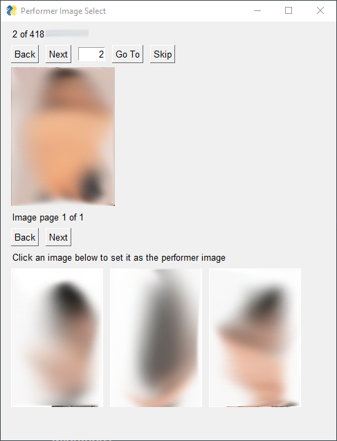

# Performer Image Selector Plugin

A stash plugin for selecting performer images from folders of images

If you have folders of images in the following structure:

```
root_folder
  Jane Doe
    image1.jpg
    image2.jpg
    image3.jpg
  Alice A
    image.png
    another_image.gif
    b.jpg
  John Doe
    1.jpg
    2.jpg
```

and you want to select a photo from each performer's folder of images to use as their stash performer image, then this plugin offers a GUI to quickly view and select photos.



The current performer image is shown on top, and the performer images in the performer-named image folder are shown at the bottom. Simply click an image to set it as the performer image.

## Installation

Put `performer_image_selector` into your `plugins` directory

Run `pip install -r requirements.txt` in the `performer_image_selector` folder

## Configuration

### Image Directories

Update `config.py` with the root path to your image folders

For the example above, 

```python
IMAGE_DIRECTORIES = [
    r'root_folder',
]
```

### Options

* `TAG_PERFORMERS`
  Applies a tag to the performer if an image is selected. *Note: The tag will also be applied if `skip` is used*

* `SHOW_UNTAGGED_ONLY`
  Whether or not to show untagged performers

* `TAG_NAME`
  Name of tag to use if `TAG_PERFORMERS = True` *Note: tag will be created if it does not exist*

## Hotkeys

* Previous Performer `A`, `Left Arrow`
* Next Performer `D`, `Right Arrow`
